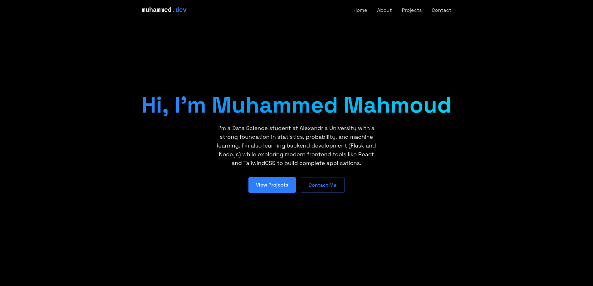

# Muhammed Mahmoud's Portfolio

Welcome to my personal portfolio website! This project showcases my skills, projects, and experience as an aspiring data scientist and web developer. Built with modern web technologies, it features a responsive design, smooth animations, and a contact form powered by EmailJS.

## Table of Contents

-   [About](#about)
-   [Features](#features)
-   [Directory Structure](#directory-structure)
-   [Installation](#installation)
-   [Usage](#usage)
-   [Demo](#demo)
-   [Screenshots](#screenshots)
-   [Contact](#contact)

## About

This portfolio is a single-page application designed to highlight my journey as a Data Science student at Alexandria University. It includes sections for my background, skills, featured projects, and a contact form for reaching out. The site is optimized for both desktop and mobile devices, with a sleek dark theme and smooth scroll-based reveal animations.

## Features

-   **Responsive Design**: Fully responsive layout with a mobile-friendly navigation menu.
-   **Loading Animation**: A dynamic loading screen with a typing effect and progress bar.
-   **Scroll Animations**: Sections fade in and slide up as they enter the viewport using the Intersection Observer API.
-   **Contact Form**: Integrated with EmailJS for sending messages directly from the website.
-   **Project Showcase**: Displays featured projects with details, technologies used, and links to GitHub repositories.
-   **Modern Styling**: Built with Tailwind CSS for a clean and customizable UI.

## Directory Structure

Below is the structure of the project directory:

```
portfolio/
├── public/
│   ├── index.html
│   └── vite.svg
├── src/
│   ├── components/
│   │   ├── LoadingScreen.jsx
│   │   ├── MobileMenu.jsx
│   │   ├── Navbar.jsx
│   │   └── RevealOnScroll.jsx
│   ├── sections/
│   │   ├── About.jsx
│   │   ├── Contact.jsx
│   │   ├── Home.jsx
│   │   ├── Projects.jsx
│   │   └── Skills.jsx
│   ├── App.jsx
│   ├── main.jsx
│   ├── App.css
│   └── index.css
├── .env
├── .eslintrc.cjs
├── package.json
├── vite.config.js
└── README.md
```

-   **public/**: Contains static assets like `index.html` and `vite.svg`.
-   **src/**: Source code for the React application.
    -   **components/**: Reusable components like `Navbar`, `MobileMenu`, `LoadingScreen`, and `RevealOnScroll`.
    -   **sections/**: Page sections for Home, About, Skills, Projects, and Contact.
    -   **App.jsx**: Main app component orchestrating the layout.
    -   **main.jsx**: Entry point for rendering the React app.
    -   **index.css**: Global styles with Tailwind CSS and custom animations.
-   **.env**: Environment variables for EmailJS configuration (not included in the repo).
-   **package.json**: Project dependencies and scripts.
-   **vite.config.js**: Vite configuration for React and Tailwind CSS.
-   **README.md**: This file.

## Installation

To run this project locally, follow these steps:

1. **Clone the repository**:

    ```bash
    git clone https://github.com/MuhammedMahmoud0/portfolio.git
    cd portfolio
    ```

2. **Install dependencies**:
   Ensure you have [Node.js](https://nodejs.org/) installed, then run:

    ```bash
    npm install
    ```

3. **Set up EmailJS** (for the contact form):

    - Create an [EmailJS](https://www.emailjs.com/) account.
    - Obtain your `SERVICE_ID`, `TEMPLATE_ID`, and `PUBLIC_KEY`.
    - Create a `.env` file in the project root and add:
        ```env
        VITE_SERVICE_ID=your_service_id
        VITE_TEMPLATE_ID=your_template_id
        VITE_PUBLIC_KEY=your_public_key
        ```

4. **Run the development server**:
    ```bash
    npm run dev
    ```
    The app will be available at `http://localhost:5173`.

## Usage

-   Navigate through the sections (Home, About, Skills, Projects, Contact) using the navbar or mobile menu.
-   Explore the projects section to view details and links to my GitHub repositories.
-   Use the contact form to send a message directly to my email via EmailJS.
-   The site features smooth animations and a responsive design, ensuring a seamless experience on any device.

## Demo

Check out the live demo of the portfolio [here](https://muhammedmahmoud-portfolio.netlify.app/).

## Screenshots

-   **Home Section**: 
-   **About Section**: 
-   **Skills Section**: 
-   **Projects Section**: 
-   **Contact Form**: 

## Contact

Feel free to reach out via the contact form on the website or connect with me on:

-   **GitHub**: [MuhammedMahmoud0](https://github.com/MuhammedMahmoud0)
-   **Email**: Use the contact form on the portfolio for direct communication.

Thanks for visiting my portfolio!
